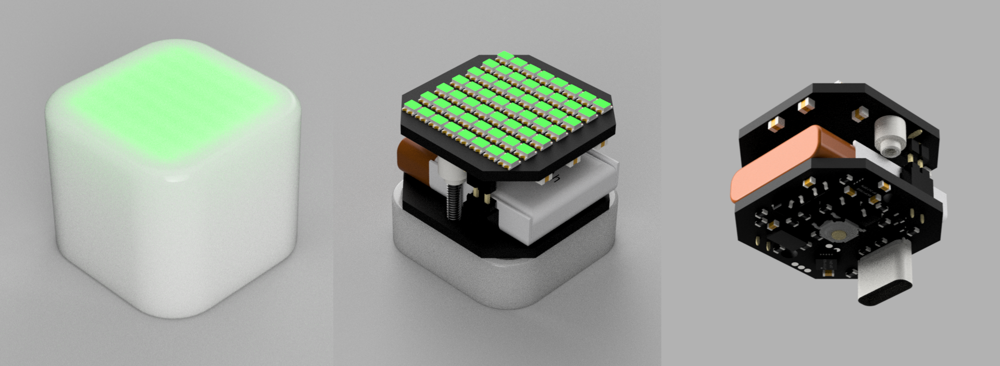
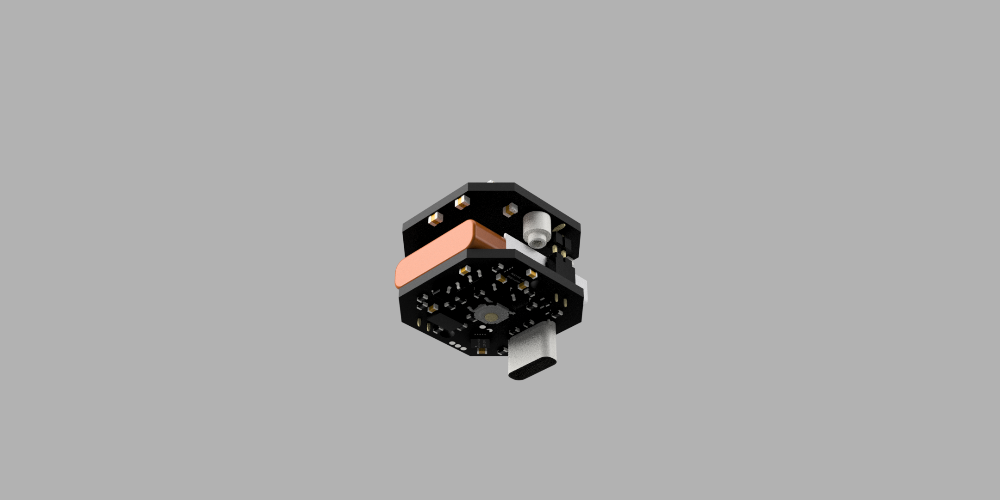

# Level Cube

A pocket-sized two-axis spirit level. An ADXL345 accelerometer measures tilt and an 8x7 matrix of
WS2812B LEDs shows a "bubble" that drifts toward the high side of whatever surface the cube is
resting on. Green means level, amber means close, red means off. One button does everything.



Firmware runs on an ATtiny1606 (16 KB flash, 1 KB RAM) using PlatformIO + megaTinyCore, powered by a
single LiPo cell with USB-C charging.

---

## Contents

- [Features](#features)
- [Using it](#using-it)
- [Hardware](#hardware)
- [Firmware](#firmware)
- [Building and flashing](#building-and-flashing)
- [Tuning](#tuning)
- [Repository layout](#repository-layout)
- [Credits and licence](#credits-and-licence)

---

## Features

- Two-axis level with a smoothly interpolated bubble (sub-pixel positioning across 2x2 LEDs).
- Works on any face of the cube: the button selects which sensor axis is "up" (X/Y/Z), the
  firmware works out whether the board is right-way-up or flipped and rotates the display so the
  UI always reads correctly.
- Per-orientation zero calibration stored in EEPROM, so the bubble reads dead centre on a known
  level surface for each of the five supported orientations.
- Soft power latch: a momentary button press turns the cube on, the MCU holds itself on, and either
  a long press or one minute of stillness turns it off (near-zero standby draw).
- Battery gauge on power-up, low-battery cut-off, USB-C LiPo charging.
- Whole thing runs in 337 bytes of RAM and 7.5 KB of flash. No floating point in the main loop.

---

## Using it

### Power on

Press the button. The cube shows:

1. **Battery gauge** - a horizontal bar across the middle row for ~0.7 s. Green above 50 %,
   amber 20-50 %, red below 20 %. If the cell is below 3.4 V the display flashes red three times
   and the cube turns itself off again.
2. **Axis glyph** - a large `X`, `Y` or `Z` for 0.5 s showing which sensor axis has been chosen as
   "up". On power-up this is auto-detected from gravity.
3. **Level display**.

### Level display

- Dim white **ticks** at the centre of each edge mark the level position.
- The **bubble** moves toward the high side of the surface, like a real spirit level. Full-scale
  deflection (bubble reaching the edge) is about 10 degrees.
- Bubble colour: **green** within ~1 degree, **amber** within ~3 degrees, **red** beyond that.

### Button

| Action | Result |
|---|---|
| Short press (< 2 s) | Cycle the "up" axis X -> Y -> Z. The glyph is shown briefly. |
| Hold 2-5 s, release | Power off. A **white** bar fills along the bottom row while held. |
| Hold > 5 s, release | Start calibration. The bar turns **red** during 2-5 s, then **blue** once 5 s is passed. |

The bar gives you feedback so you know which action you will get when you let go.

### Orientation

The ADXL345 has three axes. Whichever one is chosen as "up" is ignored for levelling; the other two
drive the bubble. For X and Y the sign of gravity along the up axis is detected automatically (with
0.5 g of hysteresis so it doesn't flicker), giving five cases:

| Case | Up axis | Bubble columns from | Bubble rows from | Display rotation |
|---|---|---|---|---|
| 0 | +X | Z | Y | column 0 at top |
| 1 | -X | Z | Y | column 7 at top |
| 2 | +Y | X | Z | normal |
| 3 | -Y | X | Z | 180 degrees |
| 4 | Z (either sign) | X | Y | normal (board flat) |

Case 4 is the "cube sitting on its base" case. Cases 0-3 are for standing the cube on a side and
using an edge as the reference. The mapping and signs are in `AXIS_MAP` in `include/config.h`.

### Calibration

Each of the five cases has its own pair of zero offsets. To calibrate:

1. Select the axis you want to calibrate (short presses until the correct glyph shows).
2. Hold the button until the hold bar turns blue (> 5 s), then release.
3. A **5-4-3-2-1 countdown** is shown. Put the cube down on your reference surface and take your
   hands off it.
4. A blue dot chases around the perimeter for 1.5 s while 150 raw samples are averaged; a blue bar
   in the centre row shows progress.
5. A green **tick** confirms the offsets have been saved to EEPROM.

The offsets are applied immediately and survive power cycles. Calibrating one case does not affect
the others.

### Auto power off

If no axis changes by more than ~0.7 degrees for 60 seconds (checked every 500 ms), and the
button hasn't been touched, the cube powers itself off.

---

## Hardware

Two PCBs stacked inside a translucent cube enclosure that acts as the diffuser. Design files
(Altium) and a PDF of the schematics are in `hardware/`.

| | |
|---|---|
|  |  |
| Main board (underside): MCU, accelerometer, charger, USB-C, button | LED panel stacked on pin headers above the main board and battery |

### Main board

| Function | Part | Notes |
|---|---|---|
| MCU | **ATtiny1606** (QFN20) | 16 KB flash, 1 KB SRAM, 256 B EEPROM. Programmed via UPDI on PA0. |
| Accelerometer | **ADXL345BCCZ** | I2C, address `0x53` (SDO/ALT pulled low). INT1/INT2 routed to PA5/PA6 but not used. |
| LiPo charger | **MCP73832** | PROG = 5.1 k -> ~200 mA charge current. STAT output to PC3. |
| 3.3 V regulator | **LR7533** LDO | Powers the MCU and accelerometer (`+3.3`). |
| Charge port | **USB-C** receptacle | Power only. 5.1 k pull-downs on CC1/CC2 so a C-to-C cable supplies 5 V. |
| Power latch | PMOS Q1 + NMOS Q3 | See below. |
| LED power switch | PMOS Q2 + NMOS Q4 | LED matrix supply is switched separately from the MCU. |
| Button | SW1 | Momentary, active low, to PC2 (internal pull-up). |
| Battery sense | 100 k / 100 k divider | VBAT/2 to PA1. |
| USB sense | 100 k / 100 k divider | VBUS/2 to PA2 (not currently used by firmware). |
| Battery | single LiPo cell on solder pads | Nominal 3.7 V. |

### Power path

```
                  Q1 (PMOS)                      Q2 (PMOS)
  VBAT ───────────┬──────┬── VMCU ── LR7533 ── +3.3 (MCU, ADXL345)
                  │      │
                  │      └──────────┬── VLED ── WS2812B matrix (56x)
                  │                 │
            gate ─┴─ R1 100k        gate ─ R7 100k
              │                       │
       ┌──────┴──────┐             Q4 (NMOS) <── LED_PWR (PC1)
   D1 ─┤             │
   SW1 (button)   Q3 (NMOS) <── PWR (PC0)
```

- **Power on**: pressing the button pulls Q1's gate low through D1, powering the MCU. The very
  first thing `setup()` does is drive `PWR` (PC0) high, which turns on Q3 and keeps Q1 on after
  the button is released.
- **Power off**: the firmware drives `PWR` low. Q1 turns off and everything downstream of it loses
  power. Standby current is just the leakage through the charger and the FET.
- **LEDs**: the matrix is fed straight from the battery through Q2, enabled by `LED_PWR` (PC1).
  The 3.3 V data line drives the first WS2812B directly. The firmware turns the LED supply off
  (after clearing the frame) before pulling `PWR` low, so the matrix never sees a dirty shutdown.

### LED panel

A separate board carrying **56 x WS2812B** in an 8 wide x 7 tall grid, chained in a single
string, addressed left to right and top to bottom (LED index = `y * 8 + x`). It plugs onto the main
board via pin headers: `L_V+`, `L_GND` and `LED_DAT`.

At full white the matrix could draw around 3 A, so the firmware caps brightness (bubble 48/255,
UI elements 24/255, ticks 3/255). Through the diffuser this is plenty.

### MCU pin map

| Pin | Signal | Direction | Use |
|---|---|---|---|
| PA0 | UPDI | - | Programming/debug |
| PA1 | BATT_VOLTS | analog in | Battery voltage, VBAT/2 |
| PA2 | USB_VOLTS | analog in | VBUS/2 (unused) |
| PA3 | SPI0 SCK | internal | Bit clock for the LED driver, not routed off-chip |
| PA4 | ANA_FLOAT | - | Spare, floating |
| PA5 | AXL_INT1 | in (pull-up) | ADXL345 INT1 (unused) |
| PA6 | AXL_INT2 | in (pull-up) | ADXL345 INT2 (unused) |
| PA7 | LED_DAT | out | WS2812B data, CCL LUT1 output |
| PB0 | SCL | I2C | ADXL345 |
| PB1 | SDA | I2C | ADXL345 |
| PB2 | TX | out | Debug UART, 115200 (only when built with `-DDEBUG`) |
| PB3 | RX | in | Debug UART |
| PC0 | PWR | out | Power latch, drive high to stay on |
| PC1 | LED_PWR | out | LED matrix supply enable |
| PC2 | BUTTON | in (pull-up) | Active low |
| PC3 | CC_STAT | in (pull-up) | MCP73832 charge status (read, not yet displayed) |

---

## Firmware

### Overview

```
src/main.cpp       power latch, button state machine, orientation, calibration, auto-off, UI
src/display.*      LED frame buffer, drawing primitives, WS2812B output via CCL + SPI + TCB0
src/accel.*        minimal ADXL345 driver and EMA filter
include/config.h   pins, timings, thresholds, AXIS_MAP
include/characters.h  4x6 glyphs for digits and X/Y/Z
lib/SmoothLedCcl/  vendored WS2812 bit-banging-free driver (see below)
```

The main loop is cooperative and non-blocking: poll the accelerometer at 100 Hz, poll the button,
check for movement, check the battery every 5 s, and render a frame every 25 ms (~40 Hz).

### LED driving without bit-banging

Generating WS2812B timing on an 8-bit part while doing anything else is awkward. This project uses
the approach from Matt Shepcar's [SmoothLed](https://github.com/mattshepcar/SmoothLed): the
**SPI0** peripheral shifts the pixel bytes out, an event channel feeds SCK into **TCB0** in
single-shot mode to produce the "1-bit" pulse width, and a **CCL** look-up table (LUT1, output on
PA7) combines SCK, MOSI and the TCB output into a valid WS2812B waveform. The CPU's only job is to
refill the SPI data register from an interrupt (`ISR(SPI0_INT_vect)` in `display.cpp`), which is
why the bytes are written inverted (the LUT expects `!MOSI`).

The result is that a full 168-byte frame streams out in the background while the main loop keeps
running. `display_show()` starts a transfer; every drawing call waits for any in-flight transfer to
finish before touching the buffer.

`SmoothLedCcl.h` is vendored in `lib/SmoothLedCcl/` rather than pulled from the registry because
the upstream `PC0_SPI0_ASYNCCH2` branch references `EVSYS_ASYNCCH2`, which tinyAVR **0-series**
parts don't have. The vendored copy guards that branch so it compiles on the ATtiny1606.

TCB0 is taken by the LED driver, so `millis()` must run on TCA0. The PlatformIO board definition
for the ATtiny1606 already defines `MILLIS_USE_TIMERA0`; if you build with a different board or
core configuration, make sure that define is present or the two will fight over TCB0.

### Coordinate systems

`display.h` keeps two frames of reference:

- **Board coordinates** are fixed to the PCB (x 0-7, y 0-6). The bubble is drawn here because its
  position is physically meaningful no matter how the cube is held.
- **View coordinates** are what the person looking at the cube sees after the current rotation
  is applied. Glyphs, bars, ticks and the perimeter chaser are drawn here so they always appear
  upright. For the two 90 degree cases the view is 7 wide by 8 tall.

### Accelerometer and filtering

The ADXL345 runs at 100 Hz in full-resolution +/-2 g mode (3.9 mg/LSB, so 1 g is ~256 LSB). Each
axis is smoothed with an exponential moving average in Q8 fixed point:

```
y += (x - y) >> 4        // tau ~ 160 ms at 100 Hz
```

Tilt is then handled as Q4 LSB values. For small angles `LSB ~= 256 * sin(angle)`, which is where
the thresholds in `config.h` come from (4.5 LSB ~ 1 degree, 13.4 LSB ~ 3 degrees, 45 LSB ~ 10
degrees). Calibration averages *raw* (unfiltered) samples over the 1.5 s window so the filter's
lag doesn't bias the result.

### EEPROM layout

| Address | Contents |
|---|---|
| 0 | Magic byte `0xA5` (offsets valid) |
| 1-20 | `int16_t calOffset[5][2]` - per case `[col, row]` zero offsets in Q4 LSB |

If the magic byte is missing all offsets are treated as zero.

### Resource usage

```
RAM:   337 / 1024 bytes  (168 of which is the LED frame buffer)
Flash: 7550 / 16384 bytes
```

---

## Building and flashing

Requires [PlatformIO](https://platformio.org/) (CLI or VS Code extension). The `atmelmegaavr`
platform and megaTinyCore are fetched automatically on first build.

```sh
pio run                  # build
pio run -t upload        # flash via UPDI (Atmel-ICE by default, see platformio.ini)
```

Connect the programmer to the UPDI pad (PA0), GND and 3.3 V. To use a different UPDI programmer
(e.g. SerialUPDI, pymcuprog, jtag2updi) change `upload_protocol` in `platformio.ini`.

### Debug output

Build with `DEBUG` defined to get a 115200 baud log on PB2 (power-up, axis changes, case changes,
battery voltage, calibration results, and periodic tilt values):

```powershell
$env:PLATFORMIO_BUILD_FLAGS="-DDEBUG"; pio run -t upload
pio device monitor
```

or uncomment `-DDEBUG` under `build_flags` in `platformio.ini`.

There are no automated tests - everything is verified on the hardware.

---

## Tuning

Everything adjustable lives in `include/config.h`:

| Constant | Default | Meaning |
|---|---|---|
| `TILT_FULL_SCALE_LSB` | 45 (~10 deg) | Tilt that puts the bubble at the edge of the matrix |
| `TILT_LEVEL_LSB` | 4.5 (~1 deg) | Bubble turns green inside this radius |
| `TILT_NEAR_LSB` | 13.4 (~3 deg) | Amber inside this, red beyond |
| `ACCEL_FILTER_SHIFT` | 4 | EMA strength; higher = smoother but slower |
| `BUBBLE_BRIGHTNESS` etc. | 48 / 24 / 3 | Per-channel brightness caps |
| `BUTTON_POWER_OFF_MS` | 2000 | Hold time for power off |
| `BUTTON_CALIBRATE_MS` | 5000 | Hold time for calibration |
| `AUTO_OFF_MS` | 60000 | Stillness before auto power off |
| `MOVE_THRESHOLD_LSB` | 3 (~0.7 deg) | Change that counts as movement |
| `V_BAT_MIN_MV` / `V_BAT_FULL_MV` | 3400 / 4150 | Battery gauge end points and cut-off |
| `CAL_COUNTDOWN_MS` / `CAL_SAMPLE_MS` | 5000 / 1500 | Calibration countdown and averaging window |
| `AXIS_MAP` | - | Axis mapping, signs and rotation per orientation case |

If the bubble moves the wrong way for a given orientation, flip the relevant `colSign`/`rowSign`
in `AXIS_MAP`; if the UI is drawn on its side or upside down, change that case's `rotation`.

---

## Repository layout

```
.
├── src/                  firmware sources (main, display, accel)
├── include/              config.h, characters.h
├── lib/SmoothLedCcl/     vendored WS2812 CCL driver (MIT) with 0-series fix
├── hardware/             Altium project, schematics (.SchDoc), PCB (.PcbDoc), schematic PDF
├── images/               renders used in this README
├── platformio.ini        build configuration (Upload_UPDI env)
└── AGENTS.md             short orientation notes for AI coding assistants
```

---

## Credits and licence

- WS2812 CCL/SPI driver technique and `SmoothLedCcl.h`: Matt Shepcar,
  [mattshepcar/SmoothLed](https://github.com/mattshepcar/SmoothLed), MIT licence
  (see `lib/SmoothLedCcl/LICENSE`).
- Arduino core: [megaTinyCore](https://github.com/SpenceKonde/megaTinyCore) by Spence Konde.
- Hardware and firmware: Peake Electronic Innovation.
